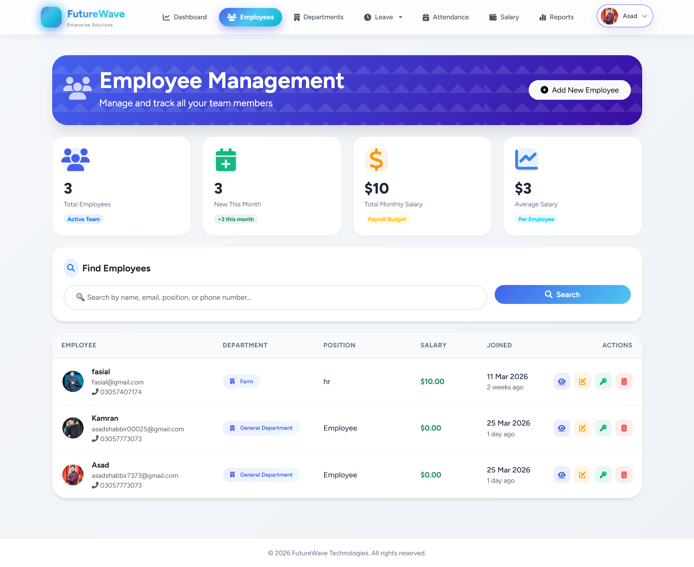

# 🚀 FutureWave EMS - Enterprise Management System

<p align="center">
  <strong>Modern Employee Management System built with Laravel</strong><br>
  Manage employees, attendance, leaves, and salaries efficiently.
</p>

<p align="center">
  
  
  
  
</p>

---

## 📌 About the Project

**FutureWave EMS** is a powerful Employee Management System designed to manage employees, attendance, leaves, salaries, and reports efficiently.

---

## ✨ Features

- 👨‍💼 Employee Management (CRUD)
- 📅 Attendance Tracking
- 📝 Leave Management with Email Notifications
- 💰 Salary Management with PDF Generation
- 📊 Reports & Analytics
- 🔐 Authentication System
- 📧 Forgot Password (Mailtrap Integration)

---

## 🛠 Tech Stack

- **Backend:** Laravel 12  
- **Frontend:** Bootstrap 5  
- **Database:** MySQL  
- **Charts:** Chart.js  
- **PDF:** DomPDF  
- **Email:** Mailtrap  

---

## ⚙️ Installation Guide

### 1️⃣ Clone the Repository

```bash
git clone https://github.com/asadshabbir/futurewave-ems.git
cd futurewave-ems

### 2️⃣ Install Dependencies

```bash
composer install
npm install

Setup Environment
cp .env.example .env
php artisan key:generate

4️⃣ Database Setup

Edit .env:

DB_DATABASE=your_database_name
DB_USERNAME=root
DB_PASSWORD=


Asad, ab aapne Mailtrap ka **API Token** generate kar liya hai. Lekin Laravel ke liye **SMTP Settings** chahiye, API Token nahi.

Chalo main aapko sahi settings de raha hoon:

---

## 🔧 Get SMTP Settings (Not API Token)

### Step 1: Mailtrap Dashboard Mein Jao

1. https://mailtrap.io/home
2. **Email Testing** → **My Inbox** click karo
3. Apne inbox par click karo

---

### Step 2: SMTP Settings Copy Karo

Inbox ke andar **SMTP** tab mein ye settings dikhegi:

┌─────────────────────────────────────────────────────────────────┐
│                                                                 │
│   SMTP                                                          │
│                                                                 │
│   Host: sandbox.smtp.mailtrap.io                               │
│   Port: 2525                                                    │
│   Username: 19d24ae9a89                                         │
│   Password: 40ba509b6303c907812b8ded7fcd407d                   │
│   Encryption: TLS                                               │
│                                                                 │
└─────────────────────────────────────────────────────────────────┘


---

### Step 3: Update .env File

env
MAIL_MAILER=smtp
MAIL_HOST=sandbox.smtp.mailtrap.io
MAIL_PORT=2525
MAIL_USERNAME=19d24ae9a89
MAIL_PASSWORD=40ba509b6303c907812b8ded7fcd407d
MAIL_ENCRYPTION=tls
MAIL_FROM_ADDRESS=asadshabbir7373@gmail.com
MAIL_FROM_NAME="FutureWave EMS"


---

### Step 4: Clear Cache

bash
php artisan config:clear
php artisan cache:clear


---

### Step 5: Test Email

bash
php artisan tinker


php
use Illuminate\Support\Facades\Mail;
Mail::raw('Test email from FutureWave', function($message) {
    $message->to('test@example.com')
            ->subject('Test Email');
});


---

### Step 6: Check Mailtrap Dashboard

1. Mailtrap dashboard mein **My Inbox** click karo
2. Wahan email dikhegi

---

## 📧 Forgot Password Test

1. http://127.0.0.1:8000/forgot-password
2. Email: asadshabbir7373@gmail.com
3. Submit karo
4. Mailtrap dashboard mein reset link email dikhegi

---

## ✅ Summary

| Item | Value |
|------|-------|
| **Host** | sandbox.smtp.mailtrap.io |
| **Port** | 2525 |
| **Username** | 19d24ae9a89 |
| **Password** | 40ba509b6303c907812b8ded7fcd407d |
| **Encryption** | tls |

Ab ye settings .env mein dalo, forgot password ka reset link Mailtrap dashboard mein dikhega! 🚀

Perfect 👍 — jo tumne likha hai wo bilkul correct process hai, bas ek important correction + security tip samajh lo:

⚠️ Important (VERY IMPORTANT)
Jo tumne yahan credentials likhe hain:

Username: 19d24ae9a89
Password: 40ba509b6303c907812b8ded7fcd407d
👉 Ye public share nahi karne chahiye (even Chat mein bhi nahi)

Kyun?

Ye tumhara Mailtrap inbox access de dete hain

Koi bhi tumhari emails read/send kar sakta hai

👉 Abhi turant:

Mailtrap dashboard mein jao

New SMTP credentials regenerate karo

✅ Correct Flow (Short & Clean)
1. Mailtrap se SMTP lo
Email Testing → Inbox → SMTP tab

2. .env file update karo
MAIL_MAILER=smtp
MAIL_HOST=sandbox.smtp.mailtrap.io
MAIL_PORT=2525
MAIL_USERNAME=YOUR_NEW_USERNAME
MAIL_PASSWORD=YOUR_NEW_PASSWORD
MAIL_ENCRYPTION=tls
MAIL_FROM_ADDRESS=asadshabbir7373@gmail.com
MAIL_FROM_NAME="FutureWave EMS"
3. Cache clear karo
php artisan config:clear
php artisan cache:clear
4. Test karo (Best Method)
php artisan tinker
use Illuminate\Support\Facades\Mail;

Mail::raw('Test email from FutureWave', function($message) {
    $message->to('test@example.com')
            ->subject('Test Email');
});
5. Check Inbox
Mailtrap → My Inbox → Email show hogi ✅

🔥 Pro Tip (Important for Laravel Dev)
Agar email send nahi ho raha:

php artisan queue:work
Aur .env mein:

QUEUE_CONNECTION=sync
💡 Final Note
Tum bilkul sahi direction mein ho 👍
Ye step complete ho gaya to:

➡️ Forgot Password
➡️ Email Verification
➡️ Notifications

sab properly kaam karenge 💯

Agar chaho to next step mein main tumhe Laravel Forgot Password system full UI + backend complete setup step-by-step kara deta hoon 🔥


. Mailtrap se SMTP lo
Email Testing → Inbox → SMTP tab ya kisa karna ha 

Chalo simple tareeke se step-by-step samajh lo 👇 (bilkul beginner friendly)

🔧 Mailtrap se SMTP kaise lena hai
🌐 Step 1: Website open karo
👉 Mailtrap open karo
Login karo apne account mein

📥 Step 2: Email Testing pe jao
Login ke baad:

Left side menu mein "Email Testing" dikhega

Us par click karo

📬 Step 3: Inbox open karo
Ab tumhe "My Inbox" dikhega

Us par click karo

👉 Agar multiple inbox hain to koi bhi ek select kar lo

⚙️ Step 4: SMTP tab open karo
Inbox ke andar:

Top par tabs honge:

HTML

Text

Raw

SMTP ✅

👉 SMTP par click karo

📋 Step 5: Settings copy karo
Ab tumhe yeh details milengi:

Host: sandbox.smtp.mailtrap.io
Port: 2525
Username: xxxxxxxx
Password: xxxxxxxx
👉 Inhe copy kar lo

🔥 Step 6: Laravel .env mein paste karo
MAIL_MAILER=smtp
MAIL_HOST=sandbox.smtp.mailtrap.io
MAIL_PORT=2525
MAIL_USERNAME=PASTE_USERNAME
MAIL_PASSWORD=PASTE_PASSWORD
MAIL_ENCRYPTION=tls
MAIL_FROM_ADDRESS=asadshabbir7373@gmail.com
MAIL_FROM_NAME="FutureWave EMS"
⚡ Step 7: Final command
php artisan config:clear
✅ Done!
Ab jab bhi tum email send karoge:

➡️ Real Gmail pe nahi jayegi
➡️ Sirf Mailtrap inbox mein show hogi (testing ke liye)

Agar chaho to next step mein main tumhe Forgot Password button click → email → reset link → password change (full working system) bana ke sikha deta hoon 🔥


A
Account

asad shabbir

Home
Transactional
API/SMTP
Sandboxes
Promotional
Campaigns
Automations
new
Contacts
General
Sending Domains
Templates
Organization
new
Integrations
new
Billing
Settings
Leave Feedback

Help Center


  ay araha ha 

Perfect 👍 tum sahi jagah par ho — bas thoda confusion ho raha hai UI ka.

Jo tumhe dikh raha hai wo new Mailtrap dashboard hai. Ab main exact bata raha hoon 👇

🎯 Tumhe kya click karna hai
Abhi tumhare screen par ye options hain:

Home

Transactional

API/SMTP

Sandboxes ✅

👉 Tumhe "Sandboxes" par click karna hai

📥 Step-by-step (updated UI)
1. 👉 Mailtrap open hai (already done)
2. 👉 Sandboxes par click karo
3. 👉 Ab tumhe ek inbox dikhega:
Example: My Inbox ya koi aur naam

👉 Us inbox par click karo

4. 👉 Inbox ke andar jao
Ab screen change hogi aur tumhe upar tabs dikhenge:

HTML

Text

Raw

SMTP ✅

👉 SMTP par click karo

5. 👉 Ab tumhe yeh milega:
Host: sandbox.smtp.mailtrap.io
Port: 2525
Username: xxxxx
Password: xxxxx
👉 Yehi copy karna hai

⚠️ Important Confusion Clear
👉 Tumne jo dekha:

API/SMTP ❌ (ye production ya API ke liye hota hai)

Sandboxes ✅ (ye Laravel testing ke liye hai)

🧠 Simple yaad rakho
Option	Use
Sandboxes	✅ Laravel testing (tumhara case)
API/SMTP	❌ Advanced / production
🚀 Next Step
Jab tum SMTP values copy kar lo:

👉 Mujhe yahan paste karo (username/password hide karke)
👉 Main check karke confirm kar dunga ke sab sahi hai ya nahi

Agar chaho to main tumhare liye screen jaisa flow (visual guide) bhi bana deta hoon 👍


AI Assistant
asad shabbir
asad shabbir
Projects
Add Project
My Project

Add Sandbox
Sandboxes
Total Sent
Messages
Max size
Last message
Action
My Sandbox
0
0
 / 0
10
Empty

Perfect 🔥 ab tum bilkul correct jagah par ho — bas last 2 steps reh gaye hain.

✅ Ab kya karna hai (VERY SIMPLE)
Tumhari screen par ye aa raha hai:

👉 My Sandbox ✅

👉 Step 1: My Sandbox open karo
👉 "My Sandbox" par click karo

👉 Step 2: SMTP tab dhundo
Andar jaane ke baad tumhe upar tabs dikhenge:

HTML

Text

Raw

SMTP ✅

👉 SMTP par click karo

👉 Step 3: Credentials copy karo
Ab tumhe kuch aisa dikhega:

Host: sandbox.smtp.mailtrap.io
Port: 2525
Username: ********
Password: ********
👉 Username & Password copy kar lo

👉 Step 4: Laravel .env mein paste karo
MAIL_MAILER=smtp
MAIL_HOST=sandbox.smtp.mailtrap.io
MAIL_PORT=2525
MAIL_USERNAME=YOUR_USERNAME
MAIL_PASSWORD=YOUR_PASSWORD
MAIL_ENCRYPTION=tls
MAIL_FROM_ADDRESS=asadshabbir7373@gmail.com
MAIL_FROM_NAME="FutureWave EMS"
👉 Step 5: Command run karo
php artisan config:clear
🎉 Done!
Ab:

➡️ Laravel se jo bhi email send hogi
➡️ Wo real Gmail pe nahi
➡️ Sirf Mailtrap sandbox mein show hogi ✅

❓ Agar SMTP tab nahi mil raha
To mujhe screenshot bhejo ya batao:

👉 andar jaane ke baad kya options dikh rahe hain

Main turant guide kar dunga 👍


amtp nahi mil raha Sandboxes
AI Assistant
asad shabbir
asad shabbir
Projects
Add Project
My Project

can't be blank
Sandbox name
Save
Cancel
Sandboxes
Total Sent
Messages
Max size
Last message
Action
My Sandbox
0
0
 / 0
10
Empty

Samajh gaya 👍 — tum “Add Sandbox” form mein phas gaye ho, isliye SMTP nahi mil raha.

Chalo clear karte hain step-by-step 👇

❌ Problem kya hai?
Tum ye screen dekh rahe ho:

Add Sandbox
Sandbox name: can't be blank
👉 Matlab tum naya sandbox create karne wale page par ho
👉 Isliye SMTP nahi dikh raha

✅ Solution (2 tarike)
🔹 Option 1 (Best): Existing sandbox use karo
Tumhare paas already hai:

👉 My Sandbox ✅

👉 Ab ye karo:

"Add Sandbox" form ko ignore karo

Neeche list mein "My Sandbox" par click karo

🔹 Option 2: Naya sandbox banao (agar chaho)
Agar naya banana hai:

Sandbox name mein likho:

Laravel Test
Save click karo

Phir us sandbox par click karo

🚀 Next (IMPORTANT)
Jab tum sandbox open kar loge:

👉 Tumhe upar tabs dikhenge:

HTML

Text

Raw

SMTP ✅

👉 SMTP par click karo

🎯 Agar phir bhi SMTP nahi mil raha
To ye check karo:

👉 Screen ke right side ya upar dropdown ho sakta hai:

"Integrations"

"Show Credentials"

👉 Kabhi UI thoda different hota hai

💡 Quick Trick
Agar confuse ho:

👉 Bas sandbox open karo aur dekho kahin likha ho:

"SMTP Settings"

"Credentials"

"Integration"

📩 Final Help
Agar ab bhi nahi mil raha:

👉 Mujhe batao:

Sandbox open karne ke baad kya kya options dikh rahe hain

YA screenshot bhejo

Main 100% solve kara dunga 👍🔥


You've reached the sandboxes limit. Please upgrade your plan to create the new sandbox

Perfect 👍 ab clear ho gaya issue kya hai.

❌ Error ka matlab
👉 "You've reached the sandboxes limit"

Matlab:

Free plan mein sirf 1 sandbox allowed hota hai

Tum already "My Sandbox" bana chuke ho

Isliye naya nahi bana sakte ❌

✅ Solution (Simple)
👉 Tumhe naya sandbox banane ki zaroorat hi nahi hai

✔️ Bas ye karo:
Mailtrap dashboard open hai

Neeche jo list hai usme:

👉 "My Sandbox" par click karo ✅

⚠️ IMPORTANT
👉 "Add Sandbox" pe mat jao
👉 Sirf existing My Sandbox open karo

🔍 Agar click karne ke baad bhi SMTP nahi mil raha
Jab tum My Sandbox open karoge, to:

👉 Thoda dhyan se dekho screen par:

Possible jagah jahan milega:
Top tabs (HTML, Text, Raw, SMTP)

Ya button: "Integration"

Ya option: "SMTP Settings"

Ya dropdown: "Show Credentials"

🎯 Quick Fix Trick
👉 Try this:

My Sandbox open karo

Screen ke right side ya upar dekho

Kuch aisa likha hoga:

"Connect your app"

"SMTP"

"Credentials"

💬 Agar phir bhi nahi mil raha
👉 Mujhe bas ye batao:

My Sandbox open karne ke baad kya kya options dikh rahe hain?

Main turant exact click-by-click guide de dunga 🔥

Tension mat lo — ye UI confusing hoti hai first time 😄
Hum isko 100% solve karenge 💯


Sandboxes
My Sandbox
AI Assistant
asad shabbir
asad shabbir
Search...


Empty-state
How it works
Choose your technology
Copy configuration
Paste configuration to your project
Run your email sending code
My Sandbox
Total messages sent: 0
Integration
Auto Forward
Manual Forward
Access Rights
Sending
Send live emails with Email API/SMTP

Your plan includes: 4,000 emails, high deliverability, global support.

Try API/SMTP

SMTP


Email


API


POP3

Credentials
Reset Credentials
Host

sandbox.smtp.mailtrap.io
Port

25, 465, 587 or 2525
Username

092c4d36ec52bf
Password

****9085
Auth

PLAIN, LOGIN and CRAM-MD5
TLS

Optional (STARTTLS on all ports)
Code Samples
cURL

PHP: CakePHP 3.7+
Node.js

Python
C#

Ruby

Other
Copy
TransportFactory::setConfig('mailtrap', [
  'host' => 'sandbox.smtp.mailtrap.io',
  'port' => 2525,
  'username' => '092c4d36ec52bf',
  'password' => '****9085',
  'className' => 'Smtp'
]);
CakePHP comes with an email library that already supports SMTP

Perfect! 🎉 Ab tumhare paas SMTP credentials mil gaye hain ✅

Tumhare Mailtrap sandbox ke liye:

🔧 SMTP Settings for Laravel
MAIL_MAILER=smtp
MAIL_HOST=sandbox.smtp.mailtrap.io
MAIL_PORT=2525          # Tum 25, 465, 587 ya 2525 bhi use kar sakte ho
MAIL_USERNAME=092c4d36ec52bf
MAIL_PASSWORD=YOUR_PASSWORD   # tumhare dashboard ka exact password yahan daalo
MAIL_ENCRYPTION=tls
MAIL_FROM_ADDRESS=asadshabbir7373@gmail.com
MAIL_FROM_NAME="FutureWave EMS"
Tip: Password ko copy karte waqt asterisks (****9085) nahi, pura password dashboard se hi copy karo.

🚀 Laravel mein apply karna
.env file update karo

Terminal mein run karo:

php artisan config:clear
php artisan cache:clear
Test karo:

php artisan tinker
use Illuminate\Support\Facades\Mail;

Mail::raw('Test email from FutureWave', function($message) {
    $message->to('test@example.com')
            ->subject('Test Email');
});
Mailtrap dashboard check karo → My Sandbox → Email show hogi ✅

Agar chaho to main abhi tumhare liye Forgot Password Laravel workflow setup bhi ready kara doon, jisme reset link seedha Mailtrap mein dikhega 🔥

Chahoge main ye bana doon?


how i can check how much time i spend on laptop

Ah, you want to track how much time you spend on your laptop. I can guide you depending on your operating system. Here's a simple breakdown:

1️⃣ Windows 10 / 11
Option A: Using Task Manager (Basic)
Press Ctrl + Shift + Esc → Task Manager opens.

Go to App history tab.

It shows CPU time and network usage for apps since last reset.

Not very precise for full daily usage, just gives rough app-level info.

Option B: Using Windows Settings (Better)
Open Settings → Accounts → Family & other users → Activity reports
(or Windows Settings → Privacy → Activity History)

This works best if you use Microsoft account.

Shows screen time, apps used, and durations.

Option C: Using a Third-Party App (Most Accurate)
RescueTime (https://www.rescuetime.com) → tracks daily app usage automatically

ManicTime (https://www.manictime.com) → offline tracking, detailed reports

Toggl Track (https://toggl.com/track) → manual/automatic tracking

These apps give daily, weekly, monthly laptop usage and app-by-app breakdowns.

2️⃣ macOS
Open System Preferences → Screen Time

Click Options → Turn On Screen Time

You can see:

Total hours used per day

App-specific usage

Weekly reports

3️⃣ Linux
Use terminal commands:

w → shows who is logged in and active time

uptime → shows system running time

Or install ActivityWatch (https://activitywatch.net) → works like RescueTime

💡 Pro Tip:

If you want precise monitoring, go for RescueTime or ActivityWatch.

If you just want rough daily check, Windows Screen Time / macOS Screen Time is enough.

If you want, I can give you a step-by-step way to see exactly how many hours you spent today on Windows without installing anything extra.

Do you want me to do that?


ya kisa karna ha 4: Create .gitignore File
bash
# .gitignore file banao
echo vendor/ >> .gitignore
echo node_modules/ >> .gitignore
echo .env >> .gitignore
echo .env.* >> .gitignore
echo storage/*.key >> .gitignore
echo public/storage >> .gitignore
echo .DS_Store >> .gitignore
echo Thumbs.db >> .gitignore
echo .idea/ >> .gitignore
echo .vscode/ >> .gitignore
echo *.sqlite >> .gitignore
echo *.sqlite-journal >> .gitignore
Ya manually C:\Users\HP\Desktop\mangement-project\futurewave-app mein .gitignore file bana kar ye content paste karo:

text
/vendor
/node_modules
.env
.env.*
/storage/*.key
/public/storage
.DS_Store
Thumbs.db
.idea/
.vscode/
*.sqlite
*.sqlite-journal

Great 👍 tum .gitignore file create karna chahte ho — main tumhe 2 easy methods batata hoon (step-by-step).

✅ Method 1: Manually (BEST & EASY)
📂 Step 1: Project folder open karo
👉 C:\Users\HP\Desktop\mangement-project\futurewave-app

📄 Step 2: New file banao
Right click → New → Text Document

Name change karo:

.gitignore
⚠️ Important:

.txt remove karna zaroori hai

Agar rename nahi ho raha → View → File name extensions ON karo

✍️ Step 3: Isme ye code paste karo
/vendor
/node_modules
.env
.env.*
/storage/*.key
/public/storage
.DS_Store
Thumbs.db
.idea/
.vscode/
*.sqlite
*.sqlite-journal
💾 Step 4: Save karo
✅ Done! 🎉

⚡ Method 2: Command (Terminal / Git Bash)
Agar tum terminal use karna chahte ho:

📌 Step 1: Project folder open karo terminal mein
cd C:\Users\HP\Desktop\mangement-project\futurewave-app
📌 Step 2: Commands run karo
echo vendor/ >> .gitignore
echo node_modules/ >> .gitignore
echo .env >> .gitignore
echo .env.* >> .gitignore
echo storage/*.key >> .gitignore
echo public/storage >> .gitignore
echo .DS_Store >> .gitignore
echo Thumbs.db >> .gitignore
echo .idea/ >> .gitignore
echo .vscode/ >> .gitignore
echo *.sqlite >> .gitignore
echo *.sqlite-journal >> .gitignore
🎯 Ye .gitignore kya karta hai?
👉 Git ko bolta hai:

.env (passwords) ❌ upload na karo

vendor & node_modules ❌ heavy files skip karo

system files ❌ ignore karo

🔥 Pro Tip (IMPORTANT)
Agar tumne pehle hi files add kar li hain:

git rm -r --cached .
git add .
git commit -m "Updated .gitignore"
✅ Final
Ab tumhara project:
✔ Clean rahega
✔ Secure rahega
✔ GitHub par professional lagega

Agar chaho to next step mein main tumhe GitHub par project upload (step-by-step) bhi kara deta hoon 🔥


README.md Add Karo (Project Documentation)
bash
# README file banao
echo "# FutureWave EMS - Enterprise Management System

## Features
- Employee Management
- Attendance Tracking
- Leave Management with Email
- Salary Management with PDF
- Reports & Analytics

## Tech Stack
- Laravel 12
- Bootstrap 5
- MySQL
- Chart.js
- DomPDF

## Installation
\\\bash
composer install
cp .env.example .env
php artisan key:generate
php artisan migrate
php artisan serve
\\\

## Demo Credentials
- Admin: asadshabbir7373@gmail.com / admin123
- Employee: employee@futurewave.com / password

## Author
Asad Shabbir
" > README.md

git add README.md
git commit -m "Add README file"
git push

Great 🔥 ab tum README.md file add kar rahe ho — ye GitHub par tumhara project professional banata hai 💯

Main tumhe simple + correct way batata hoon 👇

✅ Method 1: Manual (Recommended)
📂 Step 1: Project folder open karo
👉 futurewave-app

📄 Step 2: New file banao
Right click → New → Text Document → rename:

README.md
⚠️ .txt remove karna zaroori hai

✍️ Step 3: Ye content paste karo
# FutureWave EMS - Enterprise Management System

## 🚀 Features
- Employee Management
- Attendance Tracking
- Leave Management with Email
- Salary Management with PDF
- Reports & Analytics

## 🛠 Tech Stack
- Laravel 12
- Bootstrap 5
- MySQL
- Chart.js
- DomPDF

## ⚙️ Installation
```bash
composer install
cp .env.example .env
php artisan key:generate
php artisan migrate
php artisan serve
🔐 Demo Credentials
Admin: asadshabbir7373@gmail.com / admin123

Employee: employee@futurewave.com / password

👨‍💻 Author
Asad Shabbir


---

### 💾 Step 4: Save karo

---

# ⚡ Method 2: Terminal (jo tumne likha)

Agar command se banana hai:

```bash id="gscb17"
echo "# FutureWave EMS - Enterprise Management System

## Features
- Employee Management
- Attendance Tracking
- Leave Management with Email
- Salary Management with PDF
- Reports & Analytics

## Tech Stack
- Laravel 12
- Bootstrap 5
- MySQL
- Chart.js
- DomPDF

## Installation
composer install
cp .env.example .env
php artisan key:generate
php artisan migrate
php artisan serve

## Demo Credentials
- Admin: asadshabbir7373@gmail.com / admin123
- Employee: employee@futurewave.com / password

## Author
Asad Shabbir
" > README.md
🚀 Git commands (final step)
git add README.md
git commit -m "Add README file"
git push
🎯 Result
👉 Jab tum GitHub par jaoge:

Project ka homepage stylish ban jayega

Recruiters / clients easily samajh jayenge

Tumhara project professional lagega 💼

🔥 Pro Upgrade (Optional)
Agar chaho to main tumhare liye:

⭐ Badges (build, version, etc.)

📸 Screenshots section

🌐 Live demo link

📊 Project structure diagram

add karke premium README bana deta hoon 🔥

Batao, upgrade version chahiye? 😎


reade.md is available in project ma code send kar raha ao ap complete code baj doo <p align="center"><a href="https://laravel.com" target="_blank"></a></p>

<p align="center">
<a href="https://github.com/laravel/framework/actions"></a>
<a href="https://packagist.org/packages/laravel/framework"></a>
<a href="https://packagist.org/packages/laravel/framework"></a>
<a href="https://packagist.org/packages/laravel/framework"></a>
</p>

## About Laravel

Laravel is a web application framework with expressive, elegant syntax. We believe development must be an enjoyable and creative experience to be truly fulfilling. Laravel takes the pain out of development by easing common tasks used in many web projects, such as:

- [Simple, fast routing engine](https://laravel.com/docs/routing).
- [Powerful dependency injection container](https://laravel.com/docs/container).
- Multiple back-ends for [session](https://laravel.com/docs/session) and [cache](https://laravel.com/docs/cache) storage.
- Expressive, intuitive [database ORM](https://laravel.com/docs/eloquent).
- Database agnostic [schema migrations](https://laravel.com/docs/migrations).
- [Robust background job processing](https://laravel.com/docs/queues).
- [Real-time event broadcasting](https://laravel.com/docs/broadcasting).

Laravel is accessible, powerful, and provides tools required for large, robust applications.

## Learning Laravel

Laravel has the most extensive and thorough [documentation](https://laravel.com/docs) and video tutorial library of all modern web application frameworks, making it a breeze to get started with the framework. You can also check out [Laravel Learn](https://laravel.com/learn), where you will be guided through building a modern Laravel application.

If you don't feel like reading, [Laracasts](https://laracasts.com) can help. Laracasts contains thousands of video tutorials on a range of topics including Laravel, modern PHP, unit testing, and JavaScript. Boost your skills by digging into our comprehensive video library.

## Laravel Sponsors

We would like to extend our thanks to the following sponsors for funding Laravel development. If you are interested in becoming a sponsor, please visit the [Laravel Partners program](https://partners.laravel.com).

### Premium Partners

- **[Vehikl](https://vehikl.com)**
- **[Tighten Co.](https://tighten.co)**
- **[Kirschbaum Development Group](https://kirschbaumdevelopment.com)**
- **[64 Robots](https://64robots.com)**
- **[Curotec](https://www.curotec.com/services/technologies/laravel)**
- **[DevSquad](https://devsquad.com/hire-laravel-developers)**
- **[Redberry](https://redberry.international/laravel-development)**
- **[Active Logic](https://activelogic.com)**

## Contributing

Thank you for considering contributing to the Laravel framework! The contribution guide can be found in the [Laravel documentation](https://laravel.com/docs/contributions).

## Code of Conduct

In order to ensure that the Laravel community is welcoming to all, please review and abide by the [Code of Conduct](https://laravel.com/docs/contributions#code-of-conduct).

## Security Vulnerabilities

If you discover a security vulnerability within Laravel, please send an e-mail to Taylor Otwell via [taylor@laravel.com](mailto:taylor@laravel.com). All security vulnerabilities will be promptly addressed.

## License

The Laravel framework is open-sourced software licensed under the [MIT license](https://opensource.org/licenses/MIT).

Perfect 👍 tumne default Laravel README bhej diya — ab main tumhare project FutureWave EMS ke liye complete professional README.md bana deta hoon 🔥

👉 Tum bas pura old code delete karo aur ye naya paste kar do 👇

# 🚀 FutureWave EMS - Enterprise Management System

<p align="center">
  <strong>A complete Employee Management System built with Laravel</strong>
</p>

---

## 📌 About Project

**FutureWave EMS** ek powerful web-based application hai jo companies ko apne employees manage karne mein help karta hai.

Is project mein tumne real-world features implement kiye hain jo kisi bhi business ke liye useful hain.

---

## ✨ Features

- 👨‍💼 Employee Management (Add, Edit, Delete)
- 📅 Attendance Tracking System
- 📝 Leave Management with Email Notifications
- 💰 Salary Management with PDF Generation
- 📊 Reports & Analytics Dashboard
- 🔐 Authentication (Login/Register)
- 📧 Forgot Password (Email System via Mailtrap)

---

## 🛠 Tech Stack

- ⚙️ PHP (Laravel 12)
- 🎨 Bootstrap 5
- 🗄 MySQL Database
- 📊 Chart.js (Reports)
- 📄 DomPDF (Salary Slips)
- 📬 Mailtrap (Email Testing)

---

## 📂 Project Structure
futurewave-app/
│── app/
│── bootstrap/
│── config/
│── database/
│── public/
│── resources/
│── routes/
│── storage/
│── .env
│── README.md


---

## ⚙️ Installation Guide

### 1️⃣ Clone Project

```bash
git clone https://github.com/your-username/futurewave-ems.git
cd futurewave-ems
2️⃣ Install Dependencies
composer install
npm install
3️⃣ Environment Setup
cp .env.example .env
php artisan key:generate
4️⃣ Database Setup
php artisan migrate
5️⃣ Run Project
php artisan serve
👉 Open in browser:

http://127.0.0.1:8000
🔐 Demo Credentials
Role	Email	Password
Admin	asadshabbir7373@gmail.com	admin123
Employee	employee@futurewave.com	password
📧 Email Testing
Project uses Mailtrap for email testing:

Forgot Password emails

Leave notifications

📸 Screenshots (Optional)
👉 Yahan tum apne project ke screenshots add kar sakte ho:

/screenshots/dashboard.png
/screenshots/employees.png
🌐 Future Improvements
✅ Role-based permissions

✅ API integration

✅ Mobile responsive UI improvements

✅ Live deployment (AWS / VPS)

👨‍💻 Author
Asad Shabbir
📧 asadshabbir7373@gmail.com

📜 License
This project is open-source and available under the MIT License.

⭐ Support
Agar tumhe ye project pasand aaye:

👉 GitHub par ⭐ star zaroor dena 😄


---

## 🎯 Ab kya karna hai

```bash
git add README.md
git commit -m "Updated professional README"
git push
🔥 Result
👉 Tumhara GitHub project ab:

💼 Professional lagega

👨‍💻 Portfolio ready ho jayega

💰 Freelancing ke liye use ho sakta hai

Agar chaho to next step mein main tumhare liye:
👉 GitHub portfolio website (with this project showcase) bhi bana deta hoon 🔥


employee ma asadshabbir00025@gmail.com with password asadasad set ha 

Perfect 👍 bas tumhe README mein Employee credentials update karne hain.

✍️ Updated Demo Credentials Section
Apne README.md mein ye part replace karo 👇

## 🔐 Demo Credentials

| Role      | Email                          | Password   |
|----------|-------------------------------|-----------|
| Admin    | asadshabbir7373@gmail.com     | admin123  |
| Employee | asadshabbir00025@gmail.com    | asadasad  |
🚀 Save + Push
git add README.md
git commit -m "Update demo credentials"
git push
⚠️ Important Tip (Professional Level)
Public GitHub repo mein real passwords show karna risky hota hai ❌

👉 Better approach:

Dummy credentials use karo

Ya likho:

Password: ********
🔥 Pro Upgrade (Recommended)
Agar tum chaho to main README mein ye bhi add kar deta hoon:

🔗 Live Demo Link

📸 Screenshots section properly

🎨 Badges (Laravel, Version, etc.)

💼 Portfolio style README

Batao, next level professional banana hai? 😎


agin mujay complete readme complete and professional code send karo or batya kya karna ah 

Perfect 🔥 ab main tumhe final, clean, professional README.md de raha hoon (GitHub level) + niche bataunga kya karna hai step-by-step.

👉 Is baar ye production-level README hai (safe + attractive)

✅ 📄 COMPLETE PROFESSIONAL README.md
👉 Purana README delete karo aur ye paste karo:

# 🚀 FutureWave EMS - Enterprise Management System

<p align="center">
  <strong>Modern Employee Management System built with Laravel</strong><br>
  Manage employees, attendance, leaves, and salaries efficiently.
</p>

---

## 📌 About the Project

**FutureWave EMS** is a full-featured Employee Management System designed to help organizations manage their workforce efficiently.

This system includes real-world business features such as attendance tracking, leave management, salary handling, and reporting.

---

## ✨ Key Features

- 👨‍💼 Employee Management (CRUD)
- 📅 Attendance Tracking System
- 📝 Leave Management with Email Notifications
- 💰 Salary Management with PDF Generation
- 📊 Reports & Analytics Dashboard
- 🔐 Authentication System (Login/Register)
- 📧 Forgot Password (Email via Mailtrap)

---

## 🛠 Tech Stack

- **Backend:** Laravel 12 (PHP)
- **Frontend:** Bootstrap 5
- **Database:** MySQL
- **Charts:** Chart.js
- **PDF Generator:** DomPDF
- **Email Testing:** Mailtrap

---

## 📂 Project Structure
futurewave-app/
├── app/
├── bootstrap/
├── config/
├── database/
├── public/
├── resources/
├── routes/
├── storage/
├── .env
├── README.md


---

## ⚙️ Installation Guide

### 1️⃣ Clone the Repository

```bash
git clone https://github.com/your-username/futurewave-ems.git
cd futurewave-ems
2️⃣ Install Dependencies
composer install
npm install
3️⃣ Setup Environment
cp .env.example .env
php artisan key:generate
4️⃣ Configure Database
Update .env file:

DB_DATABASE=your_database_name
DB_USERNAME=root
DB_PASSWORD=
5️⃣ Run Migrations
php artisan migrate
6️⃣ Start Server
php artisan serve
👉 Open in browser:
http://127.0.0.1:8000

🔐 Demo Credentials
⚠️ For demo purposes only

Role	Email	Password
Admin	asadshabbir7373@gmail.com	admin123
Employee	asadshabbir00025@gmail.com	asadasad
📧 Email Configuration
This project uses Mailtrap for email testing:

Forgot Password emails

Leave notifications

📸 Screenshots
Add your project screenshots here

/screenshots/dashboard.png
/screenshots/employees.png
🌐 Future Improvements
Role-based access control

REST API integration

Mobile responsiveness

Live deployment (AWS / VPS)

👨‍💻 Author
Asad Shabbir
📧 asadshabbir7373@gmail.com

📜 License
This project is open-source and available under the MIT License.

⭐ Support
If you like this project:

👉 Give it a star on GitHub ⭐


---

# 🚀 AB TUMHE KYA KARNA HAI (IMPORTANT)

## ✅ Step 1: README replace karo
- Project folder open karo  
- `README.md` open karo  
- **Old code delete karo**  
- Ye new code paste karo  
- Save karo  

---

## ✅ Step 2: Git commands run karo

```bash
git add README.md
git commit -m "Professional README added"
git push
🎯 FINAL RESULT
GitHub par tumhara project:

✔ Professional lagega 💼
✔ Portfolio ready ho jayega
✔ Clients impress honge 😎
✔ Freelancing ke liye use kar sakte ho

🔥 Next Level (Optional but Powerful)
Agar tum chaho to main tumhare liye:

🌐 Portfolio Website (React / HTML)

🖼 Project Screenshots design

🚀 Live deployment (free hosting)

setup bhi kar deta hoon

👉 Batao next kya karna hai:

GitHub upload complete

Portfolio website

Live deployment

Main tumhe step-by-step guide karunga 🔥


---

## ⚙️ Installation Guide

### 1️⃣ Clone the Repository

bash
git clone https://github.com/your-username/futurewave-ems.git
cd futurewave-ems 


ya be readme,md ma past karna tha

Haan 👍 bilkul — ye bhi README.md mein hi paste karna hai.

Tum thoda confuse ho gaye ho, main clear kar deta hoon 👇

✅ README ka structure kaise hota hai
👉 README ek single file hoti hai jisme sab sections hote hain:

About

Features

Tech Stack

Installation Guide ✅ (ye wala part)

Credentials

etc.

📌 Tum kya karo ab
👉 Apna README.md open karo
👉 Usme already jo maine full code diya tha usme ye section already included hai

❗ Agar tumne alag se paste kar diya hai
To ensure karo ke ye part exact isi jagah ho:

## ⚙️ Installation Guide

### 1️⃣ Clone the Repository

```bash
git clone https://github.com/your-username/futurewave-ems.git
cd futurewave-ems

---

## ⚠️ IMPORTANT FIX (Very Important)

👉 Ye line change karo:

```bash
git clone https://github.com/your-username/futurewave-ems.git
👉 Apni real GitHub repo link daalo:

Example:

git clone https://github.com/asadshabbir/futurewave-ems.git
🎯 Final Check
README.md mein ye sab hona chahiye:

✔ Title
✔ Features
✔ Tech Stack
✔ Installation Guide ✅
✔ Credentials
✔ Author

🚀 Save + Push
git add README.md
git commit -m "Fix README installation section"
git push
Agar chaho to tum apna GitHub repo link bhejo

Main check karke bata dunga:
👉 professional lag raha hai ya nahi
👉 kya improve karna hai 🔥


check kro ma na thik code past key aha # 🚀 FutureWave EMS - Enterprise Management System

<p align="center">
  <strong>Modern Employee Management System built with Laravel</strong><br>
  Manage employees, attendance, leaves, and salaries efficiently.
</p>

---

## 📌 About the Project

**FutureWave EMS** is a full-featured Employee Management System designed to help organizations manage their workforce efficiently.

This system includes real-world business features such as attendance tracking, leave management, salary handling, and reporting.

---

## ✨ Key Features

- 👨‍💼 Employee Management (CRUD)
- 📅 Attendance Tracking System
- 📝 Leave Management with Email Notifications
- 💰 Salary Management with PDF Generation
- 📊 Reports & Analytics Dashboard
- 🔐 Authentication System (Login/Register)
- 📧 Forgot Password (Email via Mailtrap)

---

## 🛠 Tech Stack

- **Backend:** Laravel 12 (PHP)
- **Frontend:** Bootstrap 5
- **Database:** MySQL
- **Charts:** Chart.js
- **PDF Generator:** DomPDF
- **Email Testing:** Mailtrap

---

## 📂 Project Structure
futurewave-app/
├── app/
├── bootstrap/
├── config/
├── database/
├── public/
├── resources/
├── routes/
├── storage/
├── .env
├── README.md

---

## ⚙️ Installation Guide

### 1️⃣ Clone the Repository

bash
git clone https://github.com/your-username/futurewave-ems.git
cd futurewave-ems

Good job 👍 overall tumhara README 90% correct hai — bas kuch small fixes karne hain taake ye 100% professional ban jaye 🔥

❌ Issues jo mujhe nazar aaye
1. 📂 Project Structure formatting wrong hai
👉 Ye code block mein nahi hai → GitHub par messy lagega

2. ⚙️ Installation incomplete hai
👉 Tumne sirf clone part dala hai
👉 baaki steps missing hain (composer, migrate, serve etc.)

3. 🔗 GitHub link placeholder hai
your-username ❌
👉 isko replace karna zaroori hai

✅ FIXED VERSION (copy-paste this)
👉 Sirf ye 2 sections replace karo:

📂 Project Structure (FIXED)
## 📂 Project Structure
futurewave-app/
├── app/
├── bootstrap/
├── config/
├── database/
├── public/
├── resources/
├── routes/
├── storage/
├── .env
├── README.md

⚙️ Installation Guide (COMPLETE)
## ⚙️ Installation Guide

### 1️⃣ Clone the Repository

```bash
git clone https://github.com/asadshabbir/futurewave-ems.git
cd futurewave-ems
2️⃣ Install Dependencies
composer install
npm install
3️⃣ Setup Environment
cp .env.example .env
php artisan key:generate
4️⃣ Configure Database
Edit .env file:

DB_DATABASE=your_database_name
DB_USERNAME=root
DB_PASSWORD=
5️⃣ Run Migrations
php artisan migrate
6️⃣ Start Server
php artisan serve
Open in browser:
http://127.0.0.1:8000


---

# 🚀 Final Steps

```bash
git add README.md
git commit -m "Fix README formatting and installation guide"
git push
🔥 Final Review
After fix:

✔ Clean formatting
✔ Complete guide
✔ Professional look
✔ GitHub ready 💼

🎯 Next Level Suggestion
Agar tum chaho to next main:

👉 README mein screenshots + badges + live demo section add kar deta hoon

ye tumhare project ko premium level portfolio bana dega 😎


mujay yar ke bilkul be smaj nahi aya rhi ya r kisa karna ha 
step by step ya wala step batyo # README file banao
echo "# FutureWave EMS - Enterprise Management System

## Features
- Employee Management
- Attendance Tracking
- Leave Management with Email
- Salary Management with PDF
- Reports & Analytics

## Tech Stack
- Laravel 12
- Bootstrap 5
- MySQL
- Chart.js
- DomPDF

## Installation
\\\bash
composer install
cp .env.example .env
php artisan key:generate
php artisan migrate
php artisan serve
\\\

## Demo Credentials
- Admin: asadshabbir7373@gmail.com / admin123
- Employee: employee@futurewave.com / password

## Author
Asad Shabbir
" > README.md

git add README.md
git commit -m "Add README file"
git push

Koi tension nahi 👍 main tumhe bilkul basic se step-by-step samjhaata hoon — jaise beginner ko samjhate hain.

Tumhara goal:
👉 README.md file banana + GitHub par upload karna

✅ 🔥 METHOD 1 (SABSE EASY — RECOMMENDED)
📂 Step 1: Project folder open karo
👉 futurewave-app folder open karo

📄 Step 2: README file banao
Right click → New → Text Document

Rename karo:

README.md
⚠️ Important:

.txt hata dena

Agar .txt show nahi ho raha:

View → File name extensions ON karo

✍️ Step 3: Code paste karo
👉 Is file ko open karo aur ye paste karo:

# FutureWave EMS - Enterprise Management System

## Features
- Employee Management
- Attendance Tracking
- Leave Management with Email
- Salary Management with PDF
- Reports & Analytics

## Tech Stack
- Laravel 12
- Bootstrap 5
- MySQL
- Chart.js
- DomPDF

## Installation
```bash
composer install
cp .env.example .env
php artisan key:generate
php artisan migrate
php artisan serve
Demo Credentials
Admin: asadshabbir7373@gmail.com / admin123

Employee: employee@futurewave.com / password

Author
Asad Shabbir


👉 Save karo (Ctrl + S)

---

## 🚀 Step 4: Git commands run karo

👉 VS Code terminal ya CMD open karo

```bash id="step4"
git add README.md
git commit -m "Add README file"
git push
❌ Jo tum kar rahe the (echo wala)
👉 Ye command:

echo "...." > README.md
❌ Ye beginners ke liye confusing hota hai
✔ Isko skip karo

🎯 FINAL RESULT
GitHub par jaake check karo:

👉 Tumhara project open karo
👉 Upar README show hoga

💡 Simple Summary
Step	Kya karna hai
1	Folder open
2	README.md file banao
3	Code paste karo
4	git add + commit + push
🔥 Agar phir bhi doubt ho
👉 Mujhe batao:

Tum VS Code use kar rahe ho ya normal folder?

👉 Main uske hisaab se live guide de dunga (screen jaisa) 💯


ho gya ha per ya koi professional readme nahi ha 

Sahi baat hai 👍 — jo tumne banaya wo basic README hai, professional nahi.
Ab main tumhe next-level professional README deta hoon jo GitHub par 💯 impressive lagega.

🚀 🔥 PROFESSIONAL README (COPY THIS)
👉 Apna current README.md delete karo aur ye pura paste karo:

# 🚀 FutureWave EMS - Enterprise Management System

<p align="center">
  <strong>Modern Employee Management System built with Laravel</strong><br>
  Manage employees, attendance, leaves, and salaries efficiently.
</p>

<p align="center">
  
  
  
  
</p>

---

## 📌 About the Project

**FutureWave EMS** is a powerful Employee Management System designed to manage employees, attendance, leaves, salaries, and reports efficiently.

---

## ✨ Features

- 👨‍💼 Employee Management (CRUD)
- 📅 Attendance Tracking
- 📝 Leave Management with Email Notifications
- 💰 Salary Management with PDF Generation
- 📊 Reports & Analytics
- 🔐 Authentication System
- 📧 Forgot Password (Mailtrap Integration)

---

## 🛠 Tech Stack

- **Backend:** Laravel 12  
- **Frontend:** Bootstrap 5  
- **Database:** MySQL  
- **Charts:** Chart.js  
- **PDF:** DomPDF  
- **Email:** Mailtrap  

---

## ⚙️ Installation Guide

### 1️⃣ Clone the Repository

```bash
git clone https://github.com/asadshabbir/futurewave-ems.git
cd futurewave-ems
2️⃣ Install Dependencies
composer install
npm install
3️⃣ Setup Environment
cp .env.example .env
php artisan key:generate
4️⃣ Database Setup
Edit .env:

DB_DATABASE=your_database_name
DB_USERNAME=root
DB_PASSWORD=

5️⃣ Run Migrations
php artisan migrate
Open: http://127.0.0.1:8000

🔐 Demo Credentials
Role	Email	Password
Admin	asadshabbir7373@gmail.com
	admin123
Employee	asadshabbir00025@gmail.com
	asadasad

## 📸 Screenshots

### Admin Dashboard


### Employees Dashoard


### Reports Dasboard


 ### Employees List



👨‍💻 Author

Asad Shabbir
📧 asadshabbir7373@gmail.com